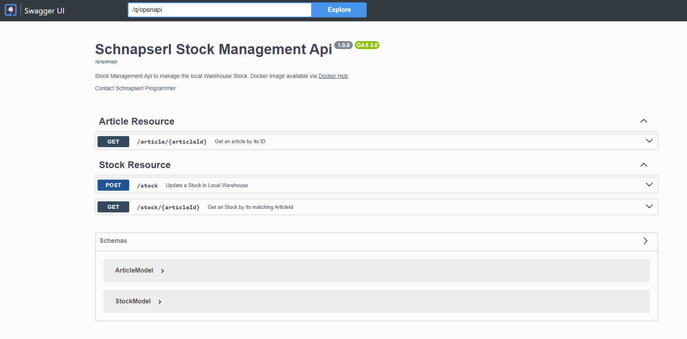

# Schnapserl Management Software Api
[](https://github.com/Thomas-Mildner/SS24_VV_Exercise02-WarehouseManagementService/actions/workflows/main.yml)

This repository will be used in Exercise02 in SS24.
The Stock Management Srvice manages the article and local stock data and is consumed by the OrderService.

To show a new and more modern framework for a microservice in addition to SpringBoot, this service is implemented using the Quarkus framework.

For more information about quarkus, see the linked documentation.

## Usage

```
docker run -p 8080:8080 vvthromildner/ss24_exercise02_stockmanagementapi:latest
```

Service should be available via http://localhost:8080/q/swagger-ui

## Endpoints




This project uses Quarkus, the Supersonic Subatomic Java Framework.

If you want to learn more about Quarkus, please visit its website: https://quarkus.io/ .

## Running the application in dev mode

You can run your application in dev mode that enables live coding using:

```shell script
./gradlew quarkusDev
```

> **_NOTE:_**  Quarkus now ships with a Dev UI, which is available in dev mode only at http://localhost:8080/q/dev/.

## Packaging and running the application

The application can be packaged using:

```shell script
./gradlew build
```

It produces the `quarkus-run.jar` file in the `build/quarkus-app/` directory.
Be aware that it’s not an _über-jar_ as the dependencies are copied into the `build/quarkus-app/lib/` directory.

The application is now runnable using `java -jar build/quarkus-app/quarkus-run.jar`.

If you want to build an _über-jar_, execute the following command:

```shell script
./gradlew build -Dquarkus.package.jar.type=uber-jar
```

The application, packaged as an _über-jar_, is now runnable using `java -jar build/*-runner.jar`.

## Creating a native executable

You can create a native executable using:

```shell script
./gradlew build -Dquarkus.native.enabled=true
```

Or, if you don't have GraalVM installed, you can run the native executable build in a container using:

```shell script
./gradlew build -Dquarkus.native.enabled=true -Dquarkus.native.container-build=true
```

You can then execute your native executable with: `./build/schnapserl-stockmanagement-1.0-SNAPSHOT-runner`

If you want to learn more about building native executables, please consult https://quarkus.io/guides/gradle-tooling.

## Related Guides

- REST ([guide](https://quarkus.io/guides/rest)): A Jakarta REST implementation utilizing build time processing and
  Vert.x. This extension is not compatible with the quarkus-resteasy extension, or any of the extensions that depend on
  it.
- Messaging - RabbitMQ Connector ([guide](https://quarkus.io/guides/rabbitmq)): Connect to RabbitMQ with Reactive
  Messaging
- Logging JSON ([guide](https://quarkus.io/guides/logging#json-logging)): Add JSON formatter for console logging

## Provided Code

### REST

Easily start your REST Web Services

[Related guide section...](https://quarkus.io/guides/getting-started-reactive#reactive-jax-rs-resources)
